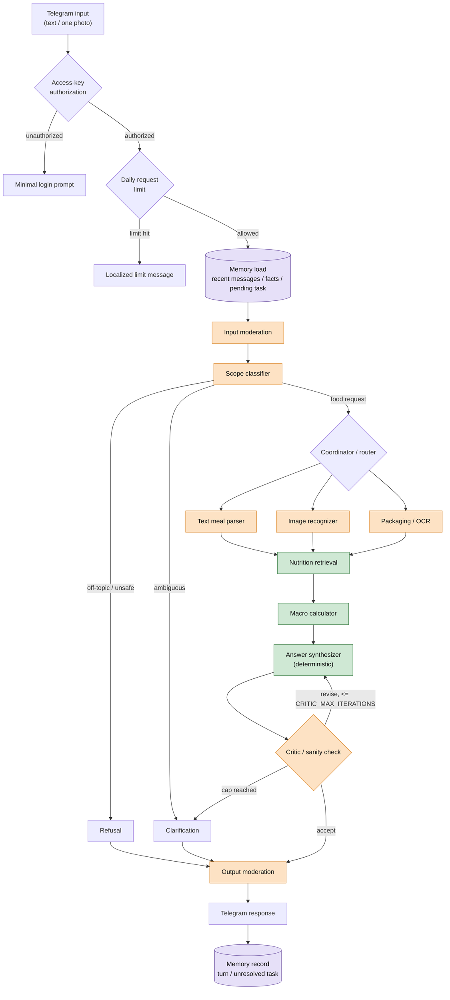
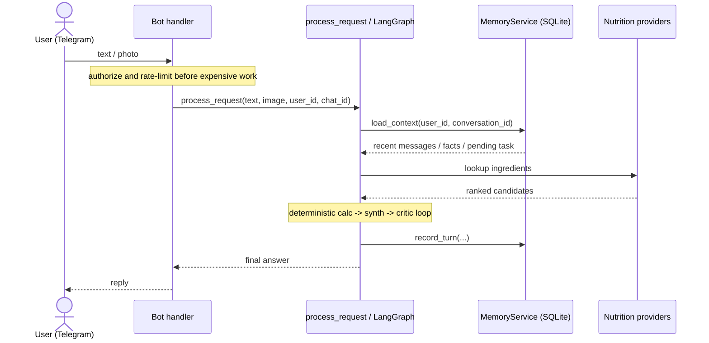

# nutrition-agent


`nutrition-agent` is an experimental Telegram bot that estimates approximate calories and macronutrients from a meal description or one food photo. It is an allow-list-only, single-maintainer MVP with no packaged releases yet.

The main design point is control: language and vision models help classify and structure uncertain food input, while calorie and macro arithmetic, answer formatting, and safety gates stay in deterministic Python.

This is not a medical product. It does not provide diagnosis, treatment plans, eating-disorder advice, or medical nutrition therapy.

## Quickstart

```bash
git clone git@github.com:fomin-n/nutrition-agent.git
cd nutrition-agent
uv sync --extra dev
cp .env.example .env
# edit .env and set:
TELEGRAM_BOT_TOKEN=replace-me
BOT_AUTH_SECRET=replace-me
OPENAI_API_KEY=replace-me
uv run python -m app.cli.auth create-key --label "demo-user"
uv run python -m app.bot.telegram_bot
```

Send `/login <access_key>` to the bot, then send a meal description or food photo.

Meal logging is often slow because users must search foods, estimate portions, and enter each ingredient manually. This project explores a controlled agent workflow that turns natural meal descriptions or photos into practical estimates with explicit assumptions.

Example response shape:

```text
Estimated calories: 520-650 kcal
Protein: 35-45 g
Fat: 15-22 g
Carbs: 55-75 g
Main assumptions:
* cooked rice: 180-220 g
* cooked chicken breast: 120-160 g
Confidence: medium
```

English and Russian text requests are supported. Image-only requests default to English because there is no language signal.

## Architecture



Legend: orange nodes may use an LLM when enabled and configured; green nodes are deterministic; purple nodes use SQLite memory. LLM-assisted nodes fall back to deterministic/local behavior when LLMs are disabled or unavailable.



## Model And Deterministic Boundaries

| Area | Behavior |
| --- | --- |
| Text model | Structured scope tiebreaks and meal parsing when local logic is insufficient. |
| Vision model | Food-photo and image+caption recognition. |
| Critic model | Optional schema-validated qualitative review after deterministic checks. |
| Moderation API | Optional; local moderation always runs first. |
| Deterministic code | Retrieval ranking, candidate validation, macro calculation, answer formatting, memory merging, rate limiting, and auth. |

The bounded `critic -> synthesize -> critic` loop can only revisit answer formatting; it cannot reparse food or recompute nutrition values. Model names and limits are configured through `.env`; see [.env.example](.env.example) for the canonical list.

## Memory

The SQLite memory layer is scoped by `(user_id, conversation_id)` and stores recent messages, a compact older summary, one unresolved nutrition task, and stable nutrition context such as allergies or measurement preferences. This lets follow-ups like “100 g, fried” resolve against an earlier chicken question without mixing users or chats. Previous assistant estimates are retained for history but excluded from parser evidence; contributor-level details live in [AGENTS.md](AGENTS.md).

## Safety Design

- Controlled LangGraph state machine, not an unconstrained agent loop.
- Model outputs that affect routing or calculation inputs are parsed through Pydantic schemas.
- User text, OCR-like text, image observations, and provider data are treated as untrusted data.
- Off-topic, hacking, prompt-extraction, unsafe diet, and medical-treatment requests are refused in English or Russian where possible.
- Unauthorized users cannot trigger expensive work; one-time access keys are stored only as HMAC-SHA256 digests.
- Telegram request limits provide a simple daily spend/abuse guard for authorized users.

## Data Sources

The retrieval policy is estimate-first but conservative: exact branded/provider data is preferred, defensible local priors are allowed, and materially ambiguous or unidentifiable foods become clarifications. Generic ingredients prefer USDA; branded, packaged, and restaurant items prefer FatSecret or branded/provider records; Open Food Facts remains a packaged-food fallback.

Food detection uses [app/tools/food_vocabulary.yaml](app/tools/food_vocabulary.yaml) as the source of truth for canonical names, aliases, fallback nutrition, default portions, localized labels, product metadata, Russian patterns, and scope-gate terms.

See [docs/nutrition-retrieval.md](docs/nutrition-retrieval.md) for provider details, candidate validation, diagnostics, cache behavior, and known limitations.

## Observability

Phoenix tracing is optional and disabled by default. When enabled, each request gets a `nutrition_agent.request` root span and LangGraph/LangChain/provider spans remain children of that request.

```bash
ENABLE_PHOENIX_TRACING=true
PHOENIX_PROJECT_NAME=nutrition-agent
PHOENIX_COLLECTOR_ENDPOINT=http://127.0.0.1:6006/v1/traces
```

Start Phoenix with `./scripts/phoenix.sh start`. Keep it bound to localhost because trace metadata includes Telegram user/chat identifiers. Full setup, SSH tunnel, metadata, and smoke-check notes are in [docs/observability.md](docs/observability.md).

## Evaluation

The repository includes offline tests, adversarial safety checks, a tiny nutrition eval, and a 111-case English/Russian golden regression set. Most evals are no-LLM/no-provider by default.

```bash
uv run python -m app.evals.run_golden_eval \
  --dataset evals/datasets/nutrition_agent_phoenix_eval_datasets_v2.jsonl \
  --split smoke
```

See [evals/README.md](evals/README.md) for adversarial evals, tiny nutrition evals, full golden runs, Phoenix dataset upload, report semantics, and contribution guidance.

## Local Development

```bash
uv sync --extra dev
uv run ruff check .
uv run pytest
uv run python -m app.evals.run_eval --mock
uv run python -m app.evals.run_retrieval_smoke
```

Live provider checks are available with `uv run python -m app.evals.run_retrieval_smoke --live` and are disabled by default.

## Configuration

| Variable | Required? | Default | Purpose |
| --- | --- | --- | --- |
| `TELEGRAM_BOT_TOKEN` | Yes | none | Telegram polling bot token. |
| `BOT_AUTH_SECRET` | Yes | none | HMAC secret for one-time access keys. |
| `OPENAI_API_KEY` | Yes for normal LLM operation | none | Structured text, vision, critic, and optional moderation calls. |
| `USDA_API_KEY` | Optional | empty | Enables USDA FoodData Central lookup. |
| `FATSECRET_CLIENT_ID` / `FATSECRET_CLIENT_SECRET` | Optional | empty | Enables FatSecret lookup. |
| `ENABLE_PHOENIX_TRACING` | Optional | `false` | Enables OpenTelemetry/Phoenix tracing. |
| `AUTH_DB_PATH`, `MEMORY_DB_PATH`, `USAGE_DB_PATH` | Optional | `data/*.sqlite3` | SQLite locations for auth, memory, and request limits. |
| `BOT_DAILY_USER_REQUEST_LIMIT`, `BOT_DAILY_GLOBAL_REQUEST_LIMIT` | Optional | `100`, `1000` | Telegram request caps; `0` disables each cap. |

See [.env.example](.env.example) for the full configuration surface.

## Known Limitations

Portion estimation from images is approximate; hidden oils, sauces, and mixed ingredients are difficult; packaged-food data can be incomplete or user-contributed; and the packaging branch does not yet perform robust barcode scanning. The app surfaces assumptions rather than claiming precision.

## Deployment And License

Deployment is intentionally documented with placeholders only. Do not commit real server addresses, usernames, bot tokens, API keys, auth databases, logs, downloaded images, or environment files.

See [AGENTS.md](AGENTS.md) for contributor-oriented technical notes. This project is released under the [MIT License](LICENSE).
