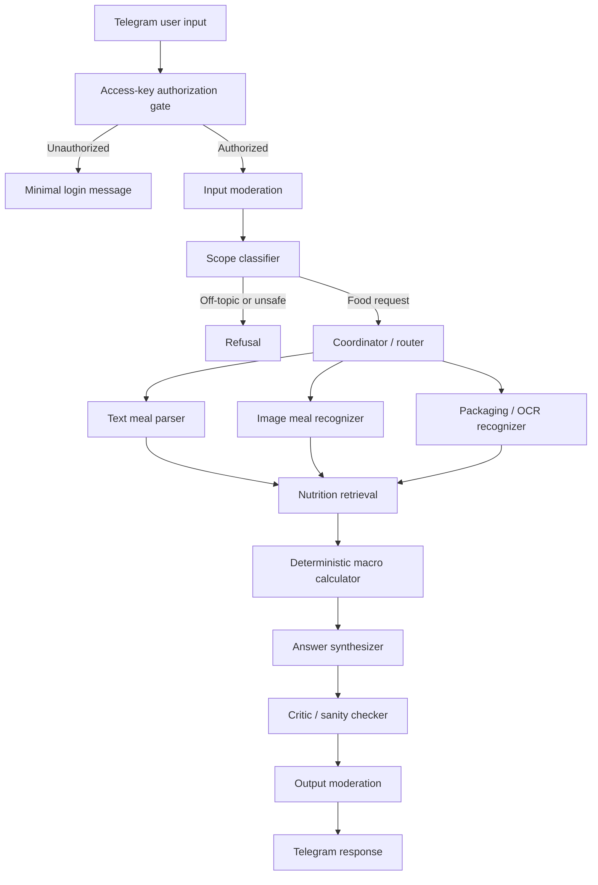

# nutrition-agent

`nutrition-agent` is an experimental agentic nutrition-estimation bot. It accepts a meal description and, optionally, a food photo through Telegram, then returns an approximate calorie and macronutrient range with explicit assumptions.

The project is designed as an engineering MVP: language and vision models help classify and structure uncertain meal input, while calorie and macro arithmetic is deterministic Python.

This is not a medical product and does not provide diagnosis, treatment plans, eating-disorder advice, or medical nutrition therapy.

## What It Solves

Meal logging is often too slow because users must manually search foods, estimate portions, and enter each ingredient. This project explores a controlled agent workflow that can turn natural meal descriptions or photos into a practical estimate:

1. A user sends a food description or photo to the Telegram bot.
2. The bot verifies that the sender is authorized.
3. The graph rejects off-topic, unsafe, or prompt-injection attempts.
4. The graph extracts ingredients and portion ranges.
5. Nutrition sources are retrieved for each ingredient.
6. A deterministic calculator computes calories, protein, fat, and carbs.
7. The response is sanity checked and returned with assumptions and confidence.

Example response shape:

```text
Estimated calories: 520-650 kcal
Protein: 35-45 g
Fat: 15-22 g
Carbs: 55-75 g
Main assumptions:
* cooked rice: 180-220 g
* cooked chicken breast: 120-160 g
* olive oil: 8-14 g
Confidence: medium
```

## Architecture



## Pipeline Stages

- **Telegram input** handles text messages and one photo with an optional caption.
- **Authorization gate** blocks unauthenticated users before any model call, image download, nutrition lookup, or graph execution.
- **Input moderation** applies conservative local checks and can use OpenAI moderation when configured.
- **Scope classifier** decides whether the request is food-related, off-topic, unsafe, or needs clarification. English and Russian meal requests are supported; image-only requests default to English responses.
- **Coordinator/router** sends the request to a text, image, combined image+text, or packaged-food branch.
- **Text meal parser** extracts ingredients and practical gram ranges from a written meal description.
- **Image meal recognizer** uses a vision-capable model to identify visible food and estimate portion ranges.
- **Packaging/OCR recognizer** supports a basic packaged-food branch for product names, labels, and future barcode/OCR work.
- **Nutrition retrieval** looks up per-100 g nutrition values using the local fallback table, USDA FoodData Central when configured, and Open Food Facts for packaged products.
- **Deterministic macro calculator** computes calories, protein, fat, and carbs from ingredient gram ranges and nutrition data.
- **Answer synthesizer** formats the result with ranges, assumptions, warnings, and confidence.
- **Critic/sanity checker** catches missing detail, inconsistent ranges, and overly wide estimates before output.
- **Output moderation** prevents unsafe or out-of-scope final content.

## Model Map

Model names are configurable through environment variables so the project can move with API availability:

- `OPENAI_TEXT_MODEL`: structured scope classification and text meal parsing when LLM mode is enabled.
- `OPENAI_VISION_MODEL`: food-photo recognition and image+caption interpretation.
- `OPENAI_CRITIC_MODEL`: reserved for model-backed critic checks; the current MVP uses deterministic critic logic.
- Answer synthesis is deterministic in the current MVP; the graph does not ask the model to invent totals or perform arithmetic.
- User-facing estimates, clarifications, and refusals are localized for English and Russian text requests. If the user sends only an image, the default response language is English.

## Safety Design

- The graph is a controlled LangGraph state machine, not an unconstrained agent loop.
- LLM outputs that affect control flow are validated with Pydantic schemas.
- Untrusted user text, OCR-like text, image observations, and external data are treated as data, not instructions.
- Off-topic, hacking, prompt-extraction, unsafe diet, and medical-treatment requests are refused.
- Unauthorized Telegram users receive only a minimal login prompt and cannot trigger expensive work.
- Access keys are one-time by default. The application stores HMAC-SHA256 digests, not raw keys.
- Final answers pass a critic/sanity-check step and output moderation before delivery.

## Data Sources

- Local fallback nutrition table for common foods.
- USDA FoodData Central lookup when `USDA_API_KEY` is configured.
- Open Food Facts lookup for packaged-food style requests.

External nutrition data can be incomplete or inconsistent, especially for packaged products. The app surfaces assumptions rather than claiming precision.

## Evaluation

Current checks include:

- Unit tests for calculator aggregation, fallback lookup, graph routing, refusal behavior, auth, and secret hygiene.
- A local adversarial eval suite for off-topic, prompt-injection, hacking, unsafe diet, and medical requests.
- Mock evaluation mode that can run without API keys.
- A tiny nutrition-quality eval using 3 rows derived from OpenIntro's public `fastfood` dataset.

Run the adversarial safety eval:

```bash
uv run python -m app.evals.run_eval --mock
```

Run the tiny nutrition eval:

```bash
uv run python -m app.evals.run_nutrition_eval --max-examples 3
```

The nutrition eval uses the OpenIntro `fastfood` dataset because it is public, small, downloadable as CSV without authentication, and includes calories plus protein, fat, and carbohydrate values. The tiny committed sample lives in `app/evals/fastfood_tiny_sample.jsonl`; the full dataset is not committed. OpenIntro describes the dataset as 515 fast-food items with nutrition fields such as calories, total fat, total carbs, and protein. OpenIntro's license page says most OpenIntro resources are released under Creative Commons BY-SA 3.0; see the dataset and license pages for attribution details:

- Dataset: https://www.openintro.org/data/index.php?data=fastfood
- CSV: https://www.openintro.org/data/csv/fastfood.csv
- License: https://www.openintro.org/license/

By default, the nutrition eval runs exactly 3 examples with `use_llm=False`, so it exercises the deterministic/local graph path and does not call OpenAI. Processing more than 3 examples requires `--allow-more-examples`; using LLM-backed graph paths requires both `--use-llm` and `--allow-paid-api`.

Metrics are intentionally simple: predicted calorie midpoint versus ground-truth calories, absolute error, percentage error, mean absolute calorie error, and macro errors for protein, fat, and carbs when present. Results are written to `reports/eval/` as timestamped JSON and Markdown files; generated result files are ignored by git.

This first nutrition eval is a smoke test, not a benchmark. Fast-food menu rows describe full prepared items, while the default no-LLM parser may map them to generic ingredients with assumed portions. Portion estimates are recorded for debugging but not scored because the dataset does not include serving weights.

Future evaluation targets:

- Nutrition5k for image meal evaluation.
- NutriBench for text meal evaluation.
- NutritionVerse-Real for real food image evaluation.

Large datasets are intentionally not downloaded by this repository.

## Known Limitations

- Portion estimation from images is approximate.
- Hidden oils, sauces, dressings, and mixed ingredients are difficult.
- Packaged-food data can be incomplete or user-contributed.
- The current packaging branch is basic and does not perform robust barcode scanning.
- The project is not medical advice and should not be used for medical nutrition therapy.

## Local Development

```bash
uv sync --extra dev
cp .env.example .env
uv run python -m app.bot.telegram_bot
```

Required environment variables:

- `OPENAI_API_KEY`
- `TELEGRAM_BOT_TOKEN`
- `BOT_AUTH_SECRET`

Optional environment variables:

- `USDA_API_KEY`
- `OPENAI_TEXT_MODEL`
- `OPENAI_VISION_MODEL`
- `OPENAI_CRITIC_MODEL`
- `OPENAI_MODERATION_ENABLED`
- `AUTH_DB_PATH`

Generate a local access key:

```bash
uv run python -m app.cli.auth create-key --label "demo-user"
```

Run checks:

```bash
uv run pytest
uv run ruff check .
uv run python -m app.evals.run_eval --mock
```

## Deployment

Deployment is intentionally documented with placeholders only. Do not commit real server addresses, usernames, bot tokens, API keys, auth databases, logs, downloaded images, or environment files.

See [AGENTS.md](AGENTS.md) for contributor-oriented technical notes.
